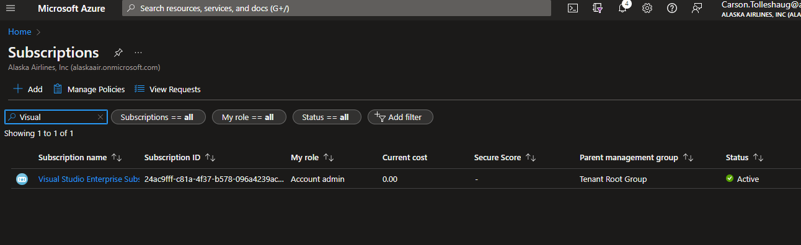
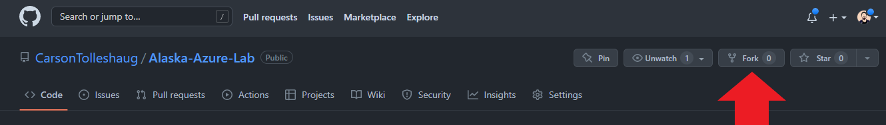
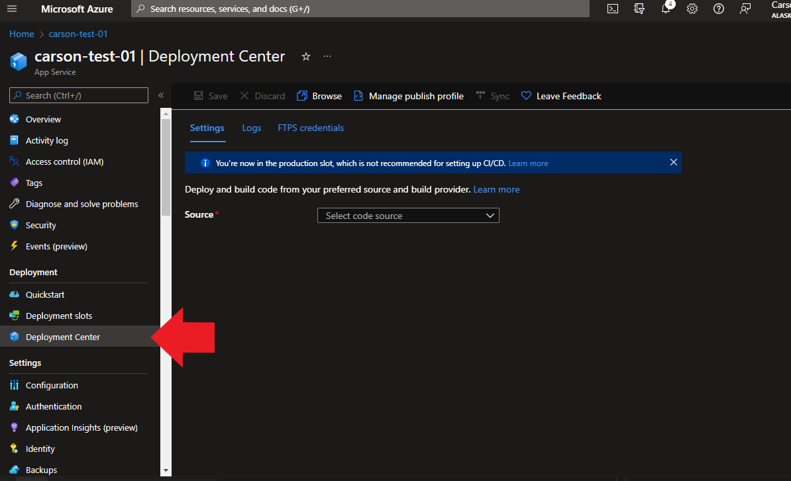

# SE-Azure-Lab
This repo contains API code for the Software Engineering Foundations Guild intern Azure lab.

# Step 1: Get Your Visual Studio Enterprise Subscription

Go to https://azure.microsoft.com/en-us/offers/ms-azr-0063p/

Click `Activate` and enter your information.

To verify it worked, go to https://portal.azure.com and go to Subscriptions, turn off the "global" filter, and search for "Visual Studio Enterprise Subscription". You should see the subscription in the list.

# Step 2: Create an App Service

# Step 3: Create a Cosmos Database

# Step 4: Fork this repo

Fork this repo to your own github account by clicking the "fork" button in the top right corner.

# Step 5: Setup CI/CD

Enable CI/CD to pull code from this repo and deploy into your azure app service. In the azure portal, navigate to your app service and click on the "Deployment Center".

On the deployment center page, select `GitHub` from the source dropdown. Use the sign in button to log into your GitHub account.

- Select your github name as the Organization
- Select `Alaska-Azure-Lab` as the Repository
- Select `main` as the Branch

Lastly click `Save`, and once it's done saving click `Sync` to deploy the code.

# Step 6: Add connection string to config

